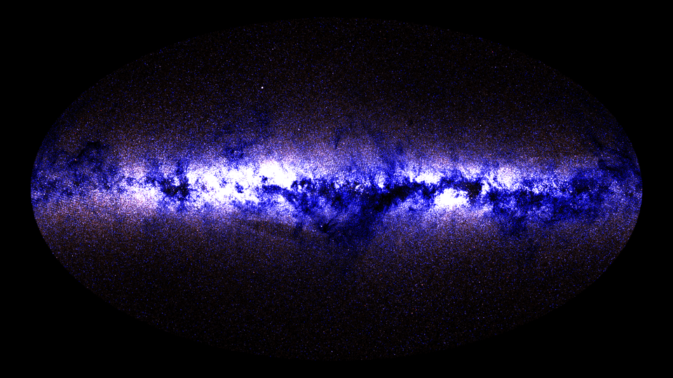
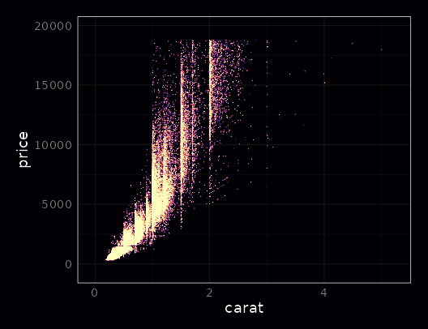

glow
================

[](https://cran.r-project.org/package=glow)

[](https://cran.r-project.org/package=glow)

*A package for making glow-y plots*

The `glow` package is a framework for creating plots with glowing points
as an alternative way of plotting large point clouds.

## Gallery

<center>

| Diamond Prices                             | Glow-y Spiral                            |
| ------------------------------------------ | ---------------------------------------- |
|  |  |

| Milky Way Galaxy (6.1 million stars)                                     |
| ------------------------------------------------------------------------ |
|  |

| Airline Dataset (145 million points)           | Methylation 450K Volcano Plot  |
| ---------------------------------------------- | ------------------------------ |
|  |  |

| U.S. Coronavirus Cases                                                     |
| -------------------------------------------------------------------------- |
|  |

</center>

## Installation

``` r
remotes::install_github("traversc/glow")
```

### Some advantages over traditional techniques

  - Naturally displays point density
      - Points are added together rather than occluding earlier points
        in a plot
  - `glow` plots don’t depend on the order of points in the data (points
    are commutative and associative)
      - Plotting a red point over a green point is the same as a green
        point over a red point
  - Very fast, can be faster than `geom_point` depending on settings
  - Multi-threaded
  - No loss of precision and individual point coordinates compared to
    binning procedures
  - Naturally works with larger-than-memory datasets (See “Airline”
    dataset in `inst/examples/examples.r`)

## Usage

Creating a glow plot is done through the `GlowMapper` or `GlowMapper4`
classes, which utilize the `R6` class framework.

The class function `$map` creates a raster that can be plotted with
`ggplot`’s `geom_raster`.

See the help files and `tests/examples.r` for more information and
examples.

``` r
library(glow)
library(ggplot2)
library(viridisLite) # Magma color scale

# Number of threads
nt <- 4

data(diamonds)
gm <- GlowMapper$new(xdim=800, ydim = 640, blend_mode = "screen", nthreads=nt)
gm$map(x=diamonds$carat, y=diamonds$price, intensity=1, radius = .1)
pd <- gm$output_dataframe(saturation = 1)

# Dark color theme
ggplot() + 
  geom_raster(data = pd, aes(x = pd$x, y = pd$y, fill = pd$value), show.legend = F) +
  scale_fill_gradientn(colors = additive_alpha(magma(12))) +
  coord_fixed(gm$aspect(), xlim = gm$xlim(), ylim = gm$ylim()) + 
  labs(x = "carat", y = "price") + 
  theme_night(bgcolor = magma(1))
```



``` r
# light color theme
light_colors <- colorRampPalette(c("red", "darkorange2", "darkgoldenrod1", "gold1", "yellow2"))(144)
ggplot() + 
  geom_raster(data = pd, aes(x = pd$x, y = pd$y, fill = pd$value), show.legend = F) +
  scale_fill_gradientn(colors = additive_alpha(light_colors)) +
  coord_fixed(gm$aspect(), xlim = gm$xlim(), ylim = gm$ylim()) + 
  labs(x = "carat", y = "price") + 
  theme_bw(base_size = 14)
```


