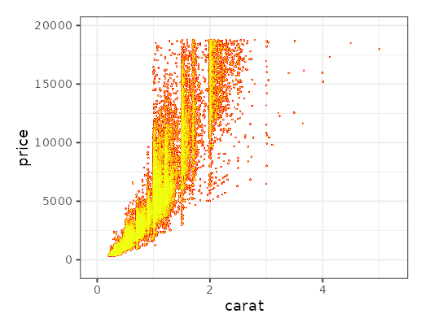

```{r, setup, echo=FALSE}
IS_GITHUB <- Sys.getenv("IS_GITHUB") != ""
```

```{r results='asis', echo=FALSE, eval=IS_GITHUB}
cat('
[](https://github.com/traversc/glow/actions)
[](https://cran.r-project.org/package=glow)
[](https://cran.r-project.org/package=glow)
[](https://cran.r-project.org/package=glow)
')
```

### A package for making glow-y plots

The `glow` package is a framework for creating plots with glowing points as an alternative way of plotting large point clouds.

## Gallery

```{r results='asis', echo=FALSE}
output <- '
<center>
|Methylation 450K Volcano Plot |Diamonds |
|-|-|
|{height=240px} |{height=240px} |

| Milky Way Galaxy (6.1 million stars) |
|-|
| {height=300px} |

| OpenStreetMap GPS traces (2.8 billion points) |
|-|
| {height=300px} |

| Clifford strange attractor (1 billion points) |
|-|
| {height=300px} |

| Airline Dataset (145 million points) | Glow-y Spiral |
|-|-|
| {height=240px} | {height=240px} |

| U.S. Coronavirus Cases (2021) |
|-|
| {height=300px} |

</center>
'

if(IS_GITHUB) {
  cat(output)
} else {
  cat(gsub("vignettes/", "", output))
}
```

## Installation
```{r eval=FALSE}
remotes::install_github("traversc/glow")
```

### Some advantages over traditional techniques

* Naturally displays point density
* `glow` plots don't depend on the order of points in the data (points are commutative and associative)
* Multi-threaded, can be faster than geom_point depending on settings
* No loss of individual points compared to binning procedures
* Naturally works with larger-than-memory datasets (See "Airline" dataset in `inst/examples/examples.r`)

## Usage

Creating a glow plot is done through the `GlowMapper` or `GlowMapper4` classes, which utilize the `R6` class framework. 

The class function `$map` creates a raster that can be plotted with `ggplot`'s `geom_raster` or output directly using the `EBImage` library.  

See the help files and `inst/examples/notes.txt` for more information on each example. 

### ggplot example using the diamonds dataset

```{r eval=FALSE}
library(glow)
library(ggplot2)
library(viridisLite) # Magma color scale

# Number of threads
nt <- 4

data(diamonds)
gm <- GlowMapper$new(xdim=800, ydim = 640, blend_mode = "screen", nthreads=nt)
gm$map(x=diamonds$carat, y=diamonds$price, intensity=1, radius = .1)
pd <- gm$output_dataframe(saturation = 1)

# Dark color theme
ggplot() + 
  geom_raster(data = pd, aes(x = pd$x, y = pd$y, fill = pd$value), show.legend = FALSE) +
  scale_fill_gradientn(colors = additive_alpha(magma(12))) +
  coord_fixed(gm$aspect(), xlim = gm$xlim(), ylim = gm$ylim()) + 
  labs(x = "carat", y = "price") + 
  theme_night(bgcolor = magma(12)[1])
```
```{r results='asis', echo=FALSE}
if(IS_GITHUB) {
  cat('{height=240px}')
} else {
  cat('{height=240px}')
}
```

```{r eval=FALSE}
# light color theme
light_colors <- light_heat_colors(144)
ggplot() + 
  geom_raster(data = pd, aes(x = pd$x, y = pd$y, fill = pd$value), show.legend = FALSE) +
  scale_fill_gradientn(colors = additive_alpha(light_colors)) +
  coord_fixed(gm$aspect(), xlim = gm$xlim(), ylim = gm$ylim()) + 
  labs(x = "carat", y = "price") + 
  theme_bw(base_size = 14)
```

```{r results='asis', echo=FALSE}
if(IS_GITHUB) {
  cat('{height=240px}')
} else {
  cat('{height=240px}')
}
```

### Writing a raster image directly

Instead of using ggplot, you can also output a raster image directly using the `EBImage` Bioconductor library. 

```{r eval=FALSE}
library(EBImage)

# Generate data
cliff_points <- clifford_attractor(1e6, 1.886,-2.357,-0.328, 0.918, 0.1, 0)
color_pal <- circular_palette(n=144, pal_function=rainbow)
cliff_points$color <- map_colors(color_pal, cliff_points$angle, min_limit=-pi, max_limit=pi)

# Create raster
gm <- GlowMapper4$new(xdim=480, ydim = 270, blend_mode = "additive", nthreads=4)
gm$map(x=cliff_points$x, y=cliff_points$y, radius=0.05, color=cliff_points$color)
pd <- gm$output_raw(saturation = 1)

# Output raster with EBImage
image_array <- array(1, dim=c(480, 270, 3))
image_array[,,1] <- pd[[1]]*pd[[4]]
image_array[,,2] <- pd[[2]]*pd[[4]]
image_array[,,3] <- pd[[3]]*pd[[4]]
img <- EBImage::Image(image_array, colormode='Color')
plot(img)
writeImage(img, "plots/clifford_vignette.png")
```

```{r results='asis', echo=FALSE}
if(IS_GITHUB) {
  cat('{height=240px}')
} else {
  cat('{height=240px}')
}
```


